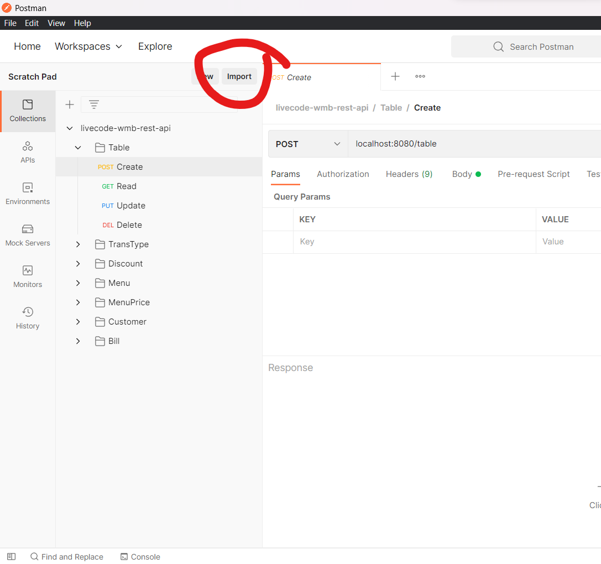
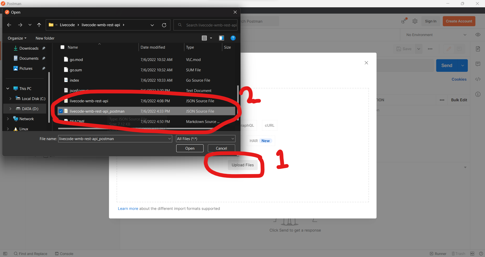
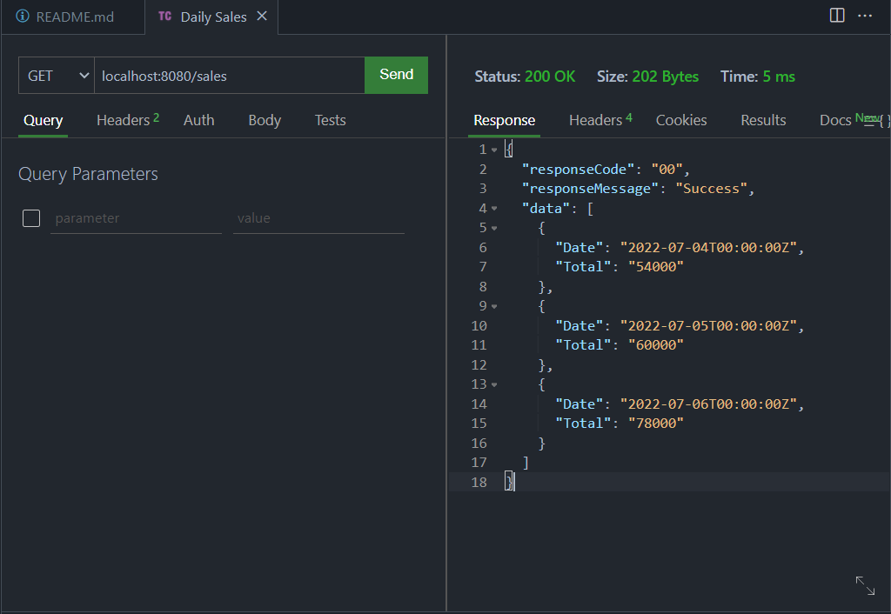

# LIVECODE WMB 2

### Create DB

1. Set Environment Variable sesuai koneksi database postgresql yang digunakan, sebuah contoh menggunakan cmd pada OS windows adalah sebagai berikut. Pada contoh ini menggunakan database `livecode_wmb_rest_api`.
```txt
set DB_HOST=localhost
set DB_USER=postgres
set DB_PASSWORD=12345678
set DB_NAME=livecode_wmb_rest_api
set DB_PORT=5432
set API_URL=localhost:8080
```

2. Apabila merupakan permulaan dari koneksi db, gunakan ENV=migration untuk create table menggunakan fungsi automigrate dari gorm. Jika bukan, dapat gunakan ENV=dev untuk menampilkan debug dari semua query yang dijalankan gorm.
```txt
set ENV=migration
set ENV=dev
```
### Execute Request
1. Lakukan login melalui request POST pada postman dengan link API_HOST:API_URL/login
```txt
{
    "username":"enigma",
    "password":"123",
	"email":""
}
```

2. Import collection request pada postman sesuai gambar-gambar berikut.





3. Request pada postman dapat dijalankan pada urutan berikut agar memaksimalkan running aplikasi.
```txt
Table
  Create
TransType
  Create Take Away
  Create Eat In
Discount
  Create (Isi discount dengan id=1 untuk discount membership wmb)
Menu
  Create
MenuPrice
  Create
Customer
  Register Customer
  Activate Member
Bill
  Create Bill TA
  Create Bill EI
  Bill Payment
  Daily Sales
```
4. Sebuah catatan, (1) Bill Payment menunjukkan subtotal sebagai penjumlahan semua item yang dibeli dan total setelah diimplementasi diskon pada subtotal tersebut, (2) Daily Sales menunjukkan data penjualan per hari tanpa dikurangi diskon dan (3) Daily Sales mendasarkan penjualan per hari dari kolom created_at, dapat diubah tanggal pada kolom untuk melihat data dalam bentuk penjualan per hari seperti contoh dibawah.



5. Silakan menjalankan request Read, Update, Delete lainnya pada collection request livecode-wmb-rest-api untuk menyesuaikan data yang tersimpan dan ditampilkan.